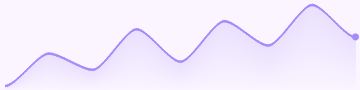
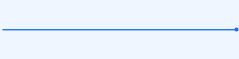
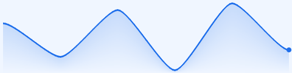

# sparklinekit

[](https://hex.pm/packages/sparklinekit)
[](https://hex.pm/packages/sparklinekit)
[](https://hexdocs.pm/sparklinekit/)
[](https://github.com/nao1215/sparklinekit/actions/workflows/ci.yml)
[](LICENSE)

Sparkline generator for Gleam. Unicode block characters for the
terminal, SVG strings for the browser, PNG byte arrays for
everything else. Pure Gleam, zero runtime dependencies, runs on
both the Erlang and JavaScript targets — each exercised in CI on
every push. Full API reference at <https://hexdocs.pm/sparklinekit/>.


## Install

```sh
gleam add sparklinekit
```

## Unicode block sparkline

```gleam
import sparklinekit/unicode

pub fn shape() -> String {
  unicode.render([1.0, 5.0, 22.0, 13.0, 5.0, 2.0, 7.0])
  // -> "▁▂█▅▂▁▃"
}
```

```gleam
import sparklinekit/unicode

pub fn shape_from_ints() -> String {
  unicode.render_ints([1, 5, 22, 13, 5, 2, 7])
  // -> "▁▂█▅▂▁▃"
}
```

```gleam
import gleam/io
import sparklinekit/unicode

pub fn print_latency(samples: List(Float)) -> Nil {
  io.println("latency  " <> unicode.render(samples))
}
```

## SVG line


```gleam
import sparklinekit/line

pub fn minimal_line() -> String {
  line.new([1.0, 5.0, 3.0, 8.0, 4.0])
  |> line.to_svg
}
```

```gleam
import sparklinekit/line
import sparklinekit/theme

pub fn themed_line() -> String {
  line.new([1.0, 5.0, 3.0, 8.0, 4.0])
  |> line.with_theme(theme.ocean())
  |> line.to_svg
}
```

```gleam
import sparklinekit/line
import sparklinekit/theme

pub fn smooth_line() -> String {
  line.new([1.0, 5.0, 3.0, 8.0, 4.0, 9.0, 6.0])
  |> line.with_theme(theme.ocean())
  |> line.with_smoothing(0.25)
  |> line.to_svg
}
```

```gleam
import sparklinekit/line
import sparklinekit/theme

pub fn area_line() -> String {
  line.new([1.0, 5.0, 3.0, 8.0, 4.0, 9.0, 6.0])
  |> line.with_theme(theme.ocean())
  |> line.with_smoothing(0.25)
  |> line.with_area_fill(True)
  |> line.with_spot(3.0)
  |> line.to_svg
}
```

```gleam
import sparklinekit/line

pub fn raw_colour_line() -> String {
  line.new([1.0, 5.0, 3.0, 8.0, 4.0])
  |> line.with_color("#378ADD")
  |> line.with_size(240, 60)
  |> line.with_stroke_width(2.0)
  |> line.to_svg
}
```

```gleam
import sparklinekit/line
import sparklinekit/theme

pub fn line_with_ints() -> String {
  line.new_ints([1, 5, 3, 8, 4])
  |> line.with_theme(theme.forest())
  |> line.to_svg
}
```

## SVG bar


```gleam
import sparklinekit/bar

pub fn minimal_bar() -> String {
  bar.new([3.0, 7.0, 2.0, 9.0, 5.0])
  |> bar.to_svg
}
```

```gleam
import sparklinekit/bar
import sparklinekit/theme

pub fn rounded_bar() -> String {
  bar.new([3.0, 7.0, 2.0, 9.0, 5.0, 11.0, 6.0])
  |> bar.with_theme(theme.sunset())
  |> bar.with_corner_radius(3.0)
  |> bar.with_bar_gap(4.0)
  |> bar.to_svg
}
```

```gleam
import sparklinekit/bar

pub fn win_loss() -> String {
  bar.new([3.0, -2.0, 5.0, -4.0, 6.0, -1.0])
  |> bar.with_color("#22A06B")
  |> bar.with_negative_color("#E5484D")
  |> bar.with_bar_gap(3.0)
  |> bar.to_svg
}
```

```gleam
import sparklinekit/bar
import sparklinekit/theme

pub fn themed_win_loss() -> String {
  bar.new_ints([3, -2, 5, -4, 6, -1])
  |> bar.with_theme(theme.forest())
  |> bar.with_corner_radius(3.0)
  |> bar.to_svg
}
```

## PNG output

The same builders produce 8-bit RGBA PNG byte arrays via `to_png/1` —
ready for `simplifile.write_bits` or `bit_array.base64_encode`.


```gleam
import sparklinekit/line

pub fn line_png() -> BitArray {
  line.new([1.0, 5.0, 3.0, 8.0, 4.0])
  |> line.with_color("#378ADD")
  |> line.with_size(240, 60)
  |> line.with_smoothing(0.25)
  |> line.with_area_fill(True)
  |> line.to_png
}
```

```gleam
import sparklinekit/bar
import sparklinekit/theme

pub fn bar_png() -> BitArray {
  bar.new([3.0, 7.0, 2.0, 9.0, 5.0, 11.0, 6.0])
  |> bar.with_theme(theme.sunset())
  |> bar.with_corner_radius(3.0)
  |> bar.to_png
}
```

```gleam
import simplifile
import sparklinekit/line

pub fn save_to_disk() {
  line.new([1.0, 5.0, 3.0, 8.0, 4.0])
  |> line.to_png
  |> simplifile.write_bits(to: "chart.png", bits: _)
}
```

## Themes

Ten built-in colour schemes, each a bundle of four CSS colour
strings (`foreground` / `background` / `area` / `negative`). Pass
one to `line.with_theme` / `bar.with_theme` to set all four slots at
once; chain `with_color` / `with_background_color` /
`with_area_color` / `with_negative_color` afterwards to override
individual slots.

| Theme | When to use | Foreground | Background | Negative | Preview |
|---|---|---|---|---|---|
| `theme.ocean()` | Default-ish blue, neutral dashboards | `#2563EB` | `#FFFFFF` | `#94A3B8` |  |
| `theme.forest()` | "Up" / growth, finance-style green | `#10B981` | `#FFFFFF` | `#EF4444` |  |
| `theme.sunset()` | Attention, trending, warm accents | `#F97316` | `#FFFFFF` | `#7C3AED` |  |
| `theme.mono()` | Print, monochrome dashboards | `#0F172A` | `#FFFFFF` | `#94A3B8` |  |
| `theme.neon()` | Dark-mode UIs, high contrast | `#22D3EE` | `#020617` | `#F472B6` |  |
| `theme.pastel()` | Low-saturation, soft palettes | `#A78BFA` | `#FAF5FF` | `#FB7185` |  |
| `theme.crimson()` | Losses, alerts, "attention required" | `#DC2626` | `#FFFFFF` | `#94A3B8` |  |
| `theme.slate()` | Corporate neutral, brand-agnostic | `#475569` | `#FFFFFF` | `#F59E0B` |  |
| `theme.amber()` | Finance / warning, softer than red | `#F59E0B` | `#FFFFFF` | `#DC2626` |  |
| `theme.midnight()` | Dark-mode default, off-white on navy | `#F8FAFC` | `#020617` | `#FB7185` |  |

`theme.default()` is also available and applied implicitly when no
`with_theme` call is made: `currentColor` foreground (inherits the
surrounding CSS colour), no background fill, an auto-derived area
tint, and `#EF4444` for negative bars.

```gleam
import sparklinekit/line
import sparklinekit/theme

pub fn theme_gallery() -> List(String) {
  let values = [1.0, 5.0, 3.0, 8.0, 4.0, 9.0, 6.0]
  let render = fn(t) {
    line.new(values)
    |> line.with_theme(t)
    |> line.with_area_fill(True)
    |> line.to_svg
  }
  [
    render(theme.ocean()),
    render(theme.forest()),
    render(theme.sunset()),
    render(theme.mono()),
    render(theme.neon()),
    render(theme.pastel()),
  ]
}
```

## Edge cases

### Empty input

```gleam
import sparklinekit/bar
import sparklinekit/line
import sparklinekit/unicode

pub fn empty_unicode() -> String {
  unicode.render([])
  // -> ""
}

pub fn empty_line_svg() -> String {
  line.new([])
  |> line.to_svg
  // -> "<svg ...></svg>" with no <path>
}

pub fn empty_bar_svg() -> String {
  bar.new([])
  |> bar.to_svg
  // -> "<svg ...></svg>" with no <rect>
}
```

The PNG counterparts (`line.to_png([])` / `bar.to_png([])`) return a
blank canvas at the configured size — useful as a placeholder while
data is loading.

### Single value / all-equal series

A single value is rendered differently per renderer, because the
"natural" shape differs. All-equal series (e.g. `[5.0, 5.0, 5.0]`)
follow the same rules.

| Renderer | Shape | Output |
|---|---|---|
| Unicode | middle block `▄` repeated | `unicode.render([5.0])` → `"▄"` |
| Line (SVG/PNG) | flat horizontal segment at the midpoint |  |
| Bar (SVG/PNG) | half-height bars rising from the bottom |  |

The bar renderer deliberately avoids filling the whole canvas with a
solid block — the half-height shape still says "constant value"
without misrepresenting the scale.

### Negative values

Negative values are fully supported. Unicode and line renderers
normalise against the observed `[min, max]`; the bar renderer uses a
zero baseline so positive and negative bars rise / fall from the
same line.




### Colour handling

- `with_color` accepts any CSS colour string. SVG attributes are
  escaped (`&`, `"`, `<`, `>`); PNG accepts `#rgb`, `#rgba`,
  `#rrggbb`, `#rrggbbaa` and falls back to the theme default
  otherwise.
- The surrounding `<svg>` is not a sanitiser. Pass the output
  through DOMPurify (or equivalent) when embedding into arbitrary
  HTML.

## License

[MIT](LICENSE)
